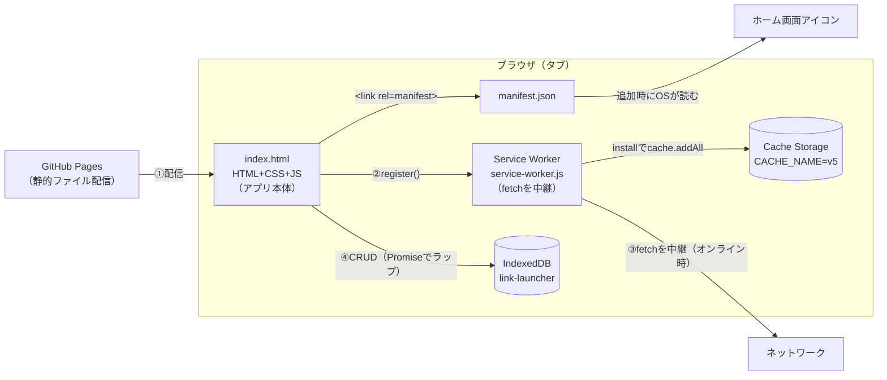
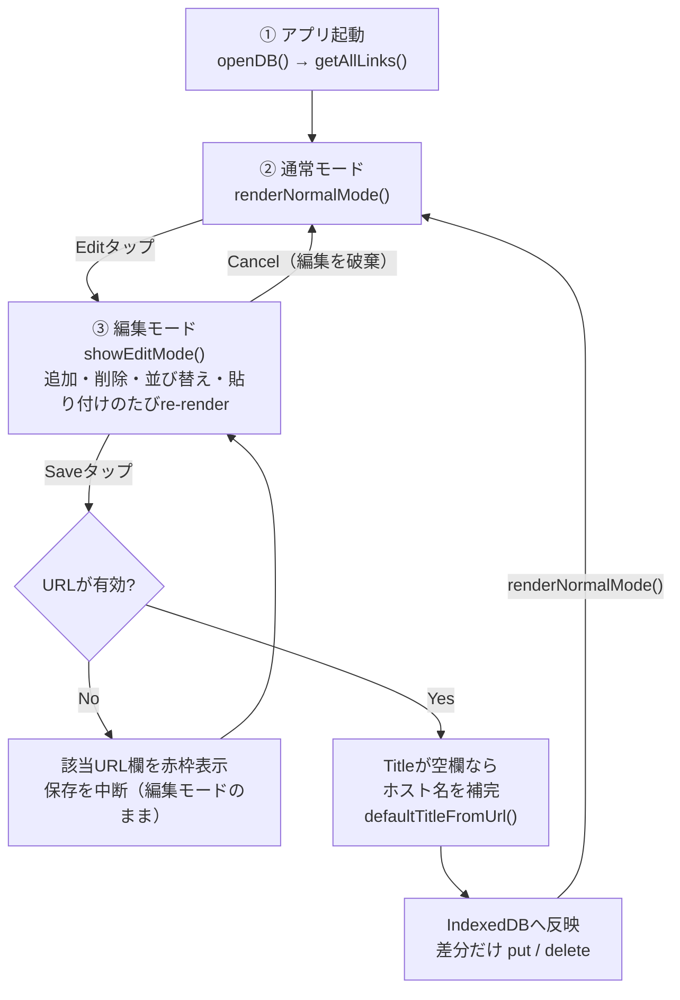

# links コードガイド

`links` はフレームワークを使わず、`index.html` 1枚に HTML・CSS・JSを内包したPWA（Progressive Web App）です。
このガイドは、このリポジトリを初めて読む人が「どこから読めばいいか」「なぜこう書かれているか」をつかめるように、実際のコードを引用しながら解説します。

対象ファイル: `index.html` / `service-worker.js` / `manifest.json`（2026年9月時点の実装）

## 目次

1. [全体像](#1-全体像--アーキテクチャ)
2. [処理の流れ](#2-処理の流れ--状態遷移)
3. [PWAの実装](#3-pwaの実装)
4. [iOSの制約](#4-iosの制約)
5. [IndexedDBの仕様](#5-indexeddbの仕様)
6. [よく使う記法](#6-よく使う記法)

---

## 1. 全体像 ― アーキテクチャ

links はビルド工程を持ちません。`index.html` をブラウザが直接読み込み、中のJavaScriptが起動時に **IndexedDB**（データの保存先）と **Service Worker**（オフライン対応の仕組み）をそれぞれ準備します。



ポイントは、**ビルドサーバーもバックエンドAPIも存在しない**ことです。「アプリのロジック」「見た目」「データの保存」「オフライン対応」の4つが、すべてブラウザというひとつの実行環境の中で完結しています。これは README にある「シンプルさ最優先」というコンセプトそのものの現れです。

---

## 2. 処理の流れ ― 状態遷移

links の画面は「通常モード（リンクをタップして開く）」と「編集モード（追加・削除・並び替え・保存）」の2つしかありません。グローバル変数 `links`（保存済みの配列）と `editModeItems`（編集中の作業コピー）の2つの配列が、この状態遷移の主役です。



編集モードに入ると `links` 配列を丸ごとコピーして `editModeItems` を作ります（`editModeItems=links.map(l=>({...l}))`）。編集中の操作はすべてこのコピーの上で行われるため、**Cancelを押せば何も保存せずに元へ戻せます**。Saveが押されたときだけ、`editModeItems` と元の `links` を比較して差分だけIndexedDBに反映します。

```js
// index.html — 初期化処理（アプリ起動時に一度だけ実行される）
(async()=>{
  await openDB();
  links=await getAllLinks();
  renderNormalMode();
  if('serviceWorker' in navigator){
    window.addEventListener('load',()=>{
      navigator.serviceWorker.register('service-worker.js')
    })
  }
})();
```

---

## 3. PWAの実装

PWAは特別なフレームワークではなく、**3つの決まりごと**を満たしたWebサイトです。links ではそれぞれ次のファイル・記述が対応します。

| 要件 | 実装場所 | 役割 |
|---|---|---|
| Webアプリマニフェスト | `manifest.json` + `<link rel="manifest">` | アプリ名・アイコン・起動時の見た目をOSに伝える |
| Service Worker | `service-worker.js` + `register()` | オフラインでも起動できるようにする |
| HTTPS配信 | GitHub Pages | Service Workerはhttps（またはlocalhost）でしか動かない |

### manifest.json

```json
{
  "name": "links",
  "short_name": "links",      // ホーム画面アイコン下の文字
  "start_url": "./",          // アイコンタップ時に開くURL
  "display": "standalone",    // ブラウザUIを消し、アプリ風に表示
  "background_color": "#0a0a0f",
  "theme_color": "#0a0a0f",
  "icons": [
    { "src": "icon-192.png", "sizes": "192x192", "type": "image/png" },
    { "src": "icon-512.png", "sizes": "512x512", "type": "image/png" }
  ]
}
```

`display:"standalone"` が「Safariのアドレスバーなしで、アプリのように起動する」ための鍵です。

### Service Worker のライフサイクル

Service Workerは「install → activate → fetch」という3つのイベントで動く、**ページとは別スレッドで動く常駐スクリプト**です。links の実装はこの3つに素直に対応しています。

```js
// service-worker.js
const CACHE_NAME = 'link-launcher-v5';
const STATIC_ASSETS = ['./', './index.html', './manifest.json'];

// ① install: 初回登録時。オフラインで使うファイルを先読みキャッシュ
self.addEventListener('install', (event) => {
  event.waitUntil(
    caches.open(CACHE_NAME)
      .then(cache => cache.addAll(STATIC_ASSETS))
      .then(() => self.skipWaiting())
  );
});

// ② activate: 新バージョン適用時。古いキャッシュを削除
self.addEventListener('activate', (event) => {
  event.waitUntil(
    caches.keys().then(keys =>
      Promise.all(keys.filter(k => k !== CACHE_NAME).map(k => caches.delete(k)))
    ).then(() => self.clients.claim())
  );
});

// ③ fetch: すべての通信をこの関数が「横取り」できる
self.addEventListener('fetch', (event) => {
  if (event.request.mode === 'navigate') {
    // ページ遷移はまずネットワークを試し、失敗したらキャッシュのindex.htmlを返す
    event.respondWith(fetch(event.request).catch(() => caches.match('./index.html')));
    return;
  }
  // それ以外（CSS/JS/画像など）はキャッシュ優先、無ければネットワーク
  event.respondWith(caches.match(event.request).then(cached => cached || fetch(event.request)));
});
```

> **キャッシュ更新のお作法：** `index.html` を書き換えたら `CACHE_NAME` の末尾（v4→v5など）を必ず上げること。同じ名前のままだと、古いキャッシュがヒットし続けてユーザーに新しい内容が届かない。

---

## 4. iOSの制約

links の実装には、iOS Safari特有の癖に対応するためだけに存在するコードが多くあります。これらを知らずに読むと「なぜこんな回りくどいことを」と感じる箇所も、理由がわかれば納得できます。

| 制約 | 内容 | 対応コード |
|---|---|---|
| DnD非対応 | iOS SafariはHTML標準のDrag&Drop APIをタッチ操作向けにきちんとサポートしていない | `pointerdown/pointermove/pointerup` を自前で処理する実装（`attachDragHandle`）に置き換え |
| ズーム | 意図しない拡大・縮小が起きやすい | `user-scalable=no` + `gesturestart`/`dblclick` を `preventDefault()` |
| ノッチ | セーフエリアに要素が被る | `env(safe-area-inset-top/bottom)` を `--safe-top`/`--safe-bottom` に取り込む |
| アプリ連携 | アプリスキーム（`googlesheets://`等）が開けたかJSから検知できない | 遷移後1.5秒待ち、`document.visibilityState==='visible'` ならブラウザで開き直すフォールバック |
| ストレージ | 7日間PWAを起動しないと、SafariがIndexedDBとCacheを消す可能性がある | ホーム画面に追加したPWAは比較的安全（README記載の既知の制約） |
| タップ感触 | 長押しメニューやハイライトがネイティブアプリらしくない | `-webkit-tap-highlight-color:transparent` / `-webkit-touch-callout:none` / `touch-action:manipulation` |

```js
// ズーム防止（index.html）
document.addEventListener('gesturestart', e => e.preventDefault());
document.addEventListener('dblclick', e => e.preventDefault());
```

```js
// アプリスキームのフォールバック（index.html openLink()）
const appUrl = url.replace('https://', 'googlesheets://');
window.location.href = appUrl;
setTimeout(() => {
  if (document.visibilityState === 'visible') {
    window.open(url, '_blank', 'noopener')
  }
}, 1500);
```

---

## 5. IndexedDBの仕様

IndexedDBは、ブラウザに内蔵された「非同期・トランザクション制」のオブジェクトデータベースです。SQLは使わず、JavaScriptのオブジェクトをそのまま保存します。ただしAPIがコールバック形式で古い書き方のため、links では最初にPromiseでラップして、以降は `await` で扱えるようにしています。

### 用語

| 用語 | 意味 |
|---|---|
| オブジェクトストア | SQLでいう「テーブル」。linksでは `links` という1つだけ |
| keyPath | 各レコードの主キーに使うフィールド名。ここでは `id` |
| インデックス | 特定フィールドで高速検索・重複チェックするための索引 |
| トランザクション | 一連の読み書きをまとめる単位。`readonly`/`readwrite` がある |

### データモデル

| フィールド | 型 | 役割 |
|---|---|---|
| `id` | string | 主キー。`generateId()` で自動採番 |
| `url` | string | 一意インデックス（重複URL防止） |
| `title` | string | 空なら保存時にホスト名で補完 |
| `icon` | string | SVGアイコン名 or 画像URL |
| `order` | number | 並び順。インデックス化して高速ソート |

### DBを開いてスキーマを定義

```js
const DB_NAME='link-launcher', DB_VERSION=1, STORE_NAME='links';

function openDB(){
  return new Promise((res,rej)=>{
    const req=indexedDB.open(DB_NAME,DB_VERSION);
    req.onupgradeneeded=e=>{
      // DBが初めて作られる時 / DB_VERSIONを上げた時だけ呼ばれる
      const d=e.target.result;
      const s=d.createObjectStore(STORE_NAME,{keyPath:'id'});
      s.createIndex('url','url',{unique:true}); // URL重複を防ぐ
      s.createIndex('order','order');           // 並び順で引けるように
    };
    req.onsuccess=()=>{db=req.result; res(db)};
    req.onerror=()=>rej(req.error)
  })
}
```

### コールバックAPIをPromiseでラップするパターン

```js
function saveLink(link){
  return new Promise((res,rej)=>{
    const tx=db.transaction(STORE_NAME,'readwrite');
    const st=tx.objectStore(STORE_NAME);
    st.put(link);                 // id が既存なら上書き、無ければ新規
    tx.oncomplete=()=>res();      // トランザクション全体の完了を待つ
    tx.onerror=()=>rej(tx.error)
  })
}
```

この形（`new Promise` で包み、`onsuccess`/`oncomplete` で `resolve`、`onerror` で `reject`）は `openDB` / `getAllLinks` / `saveLink` / `deleteLink` の4関数すべてで繰り返し使われています。一度読めば残りは同じパターンです。

---

## 6. よく使う記法

links 全体で繰り返し登場する書き方をまとめました。知っておくと読むスピードが上がります。

| 記法 | 例 | 説明 |
|---|---|---|
| アロー関数 + 即時実行 | `(async()=>{ await openDB(); })();` | ページ読み込み直後に一度だけ実行したい初期化処理を、名前を付けずにその場で実行する定番パターン |
| 省略形catch | `try{ return new URL(s); }catch{ return false }` | ES2019以降、`catch(e)`の変数を使わないなら丸ごと省略できる。`isValidUrl()`で多用 |
| オブジェクトのコピー | `editModeItems = links.map(l => ({...l}));` | スプレッド構文で「浅いコピー」を作る。元の配列を書き換えずに編集用コピーを作る |
| 文字列連結でHTML生成 | `li.innerHTML = '<span>'+escapeHtml(title)+'</span>';` | テンプレートリテラルではなく`+`連結。ユーザー入力は必ず`escapeHtml()`を通してからXSSを防ぐ |
| 配列の破壊的操作 | `const [moved]=arr.splice(from,1); arr.splice(to,0,moved);` | `splice`で「取り出して」「差し込む」。並び替えロジックの中心 |
| requestAnimationFrame | `requestAnimationFrame(()=>{ input.focus() });` | DOM追加直後は描画が確定していないことがあるため、次の描画フレームまで待ってから操作する |

### よく使う関数

| 関数 | 役割 |
|---|---|
| `escapeHtml(s)` | 文字列をHTMLエスケープ。`innerHTML`に差し込む前に必須 |
| `isValidUrl(s)` | `new URL()`が例外を投げないかでURLの妥当性を判定 |
| `haptic()` | `navigator.vibrate(10)`で短い振動フィードバック |
| `generateId()` | タイムスタンプ+乱数文字列でID採番（衝突をほぼ無視できる簡易実装） |

---

このガイドは `index.html` / `service-worker.js` / `manifest.json`（2026年9月時点の実装）を元に作成しています。実際の挙動は各ファイルのソースを一次情報として参照してください。
